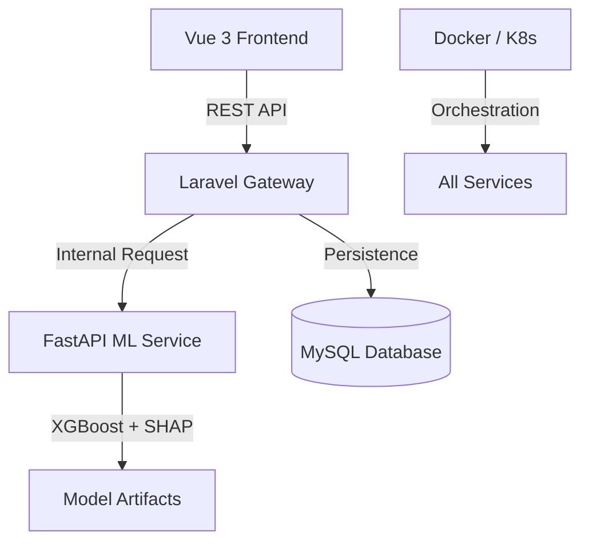

# 🏥 AI-Based Multi-Disease Risk Prediction System (v2.5)

[](https://github.com/mohamedtarek64)
[](https://www.docker.com/)
[](https://kubernetes.io/)
[](https://laravel.com/)

An advanced, enterprise-grade clinical AI ecosystem designed for high-precision disease risk assessment. The system mirrors a modern hospital's digital infrastructure, combining cutting-edge **XGBoost** models with a sophisticated **Microservices Architecture**.

---

## 🏗️ System Architecture

The project is structured as a decentralized microservices ecosystem to ensure scalability and fault tolerance:



- **Frontend (Vue 3/Vite):** A "Clinical Terminal" interface with interactive bio-metrics and real-time visualization.
- **Backend (Laravel 12):** Acts as the secure orchestration layer, managing authentication, user assessment history, and API routing.
- **ML Service (FastAPI):** High-performance Python service that performs real-time inference using specialist models.

---

## � Specialist AI Modules

The system integrates **7 Specialist Models**, each trained on clinical datasets of over **500,000 synthetic records**:

1.  **🩺 Diabetes Type 2:** Metabolic markers & insulin resistance analysis.
2.  **❤️ Cardiovascular:** Lipid profiles and arterial pressure metrics.
3.  **🧬 Oncology (Cancer):** Genetic predisposition & environmental risk scoring.
4.  **🍕 Gastrointestinal:** Digestive efficiency and localized pain frequency.
5.  **🫁 Respiratory:** Pulmonary capacity and air quality exposure analysis.
6.  **💉 Hypertension:** Advanced vascular system monitoring.
7.  **🫘 Chronic Kidney:** Renal filtration and urinary diagnostic evaluation.

---

## ✨ Key Technical Features

### 🔍 Explainable AI (XAI)
Integrated **SHAP (SHapley Additive exPlanations)** allows users to see exactly *which* factors (e.g., Blood Glucose, BMI, Age) contributed most to their risk score, turning the AI "Black Box" into a transparent clinical assistant.

### 🛡️ Premium Security & Design
- **Auth UI:** A futuristic "Clinical Terminal" design featuring glassmorphism, biometric scanning animations, and secure identity syncing.
- **Sanctum Auth:** Secure API token-based authentication with high-entropy session management.
- **Responsive Layout:** Dark-mode optimized, fluid design system using Tailwind CSS.

### ⚙️ Modern Engineering Patterns
- **Repository Pattern:** Decoupled data access logic in Laravel for cleaner, testable code.
- **Service Layer:** Centralized business logic orchestration.
- **TDD (Test-Driven Development):** High test coverage across both Backend (PHPUnit) and ML Service (Pytest).

---

## 🐳 Containerization & Deployment

### 🐳 Docker Compose
Start the entire ecosystem (DB, ML, Backend, Frontend) with a single command:
```bash
docker-compose up --build
```

### ☸️ Kubernetes (k8s) Manifests
Located in `/k8s`, the manifests support:
- **LoadBalancer Services** for external access.
- **High-Availability Replicas** for the API and ML services.
- **Environment Injection** for secure cross-service communication.

---

## 🛠️ Local Development Setup

### 1. ML Service (Python 3.10+)
```bash
cd ml-service
python -m venv venv
./venv/Scripts/activate # Windows
pip install -r requirements.txt
uvicorn app.main:app --host 127.0.0.1 --port 8001
```

### 2. Backend (Laravel 12)
```bash
cd backend/backend
composer install
cp .env.example .env
php artisan key:generate
php artisan migrate
php artisan serve
```

### 3. Frontend (Vue 3)
```bash
cd frontend
npm install
npm run dev
```

---

## 🧪 Testing

### Backend Feature Tests
```bash
php artisan test
```

### ML Service Integration Tests
```bash
cd ml-service
python -m pytest tests/test_api.py
```

---

## 📝 Future Roadmap
- [ ] Integration with Wearable Bio-sensors.
- [ ] Mobile App (React Native/Flutter) version.
- [ ] Multi-tenant support for different hospital nodes.
- [ ] Blockchain integration for secure, immutable medical records.

---
**Author:** [Mohamed Tarek](https://github.com/mohamedtarek64)  
**Version:** 2.5.0  
**License:** MIT
